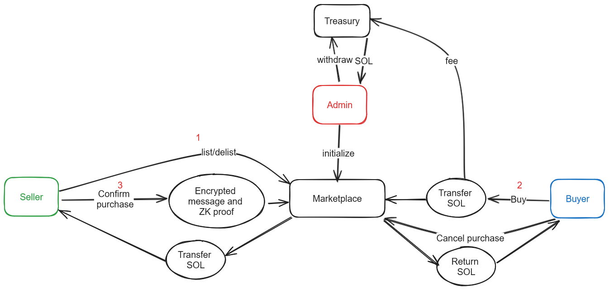
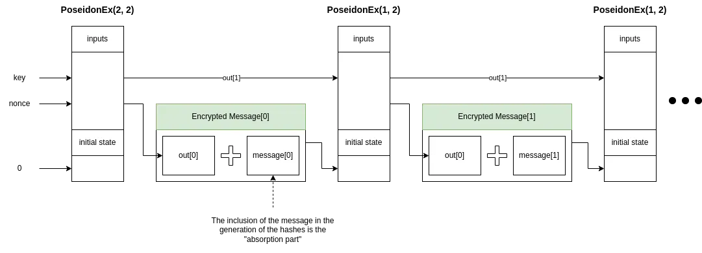

# Whisper Market

A marketplace to trade secret messages/information (e.g. software keys, login credentials for some account, etc.) using Zero Knowledge Proofs

## Description

1. A seller creates a listing providing a description, a price and a hash of the message to be traded
2. A buyer can buy the listing. The buyer and the seller agree on the encryption key off-chain (more on that later), then the buyer sends the `purchase` instruction to the program providing the encryption key hash and the nonce
3. The seller can complete the purchase by sending the `completePurchase` instruction to the program providing the encrypted message and the ZK proof

## Encryption

Messages are encrypted using Poseidon hash function.

More info [here](https://rubydusa.medium.com/symmetric-encryption-in-circom-53137de2a011)

## How to generate encryption keys

Encryption keys are generated using [ECDH Key Exchange](https://cryptobook.nakov.com/asymmetric-key-ciphers/ecdh-key-exchange). At first, Ed25519 public and private keys are converted to X25519 keys, then a seller's public key and buyers's private key (or vice versa) are multiplied to generate the encryption key.
One problem with this process is that there is no access to private keys in a wallet on frontend. So, ephemeral keys are used to generate encryption keys. A message signing mechanism is used to generate ephemeral keys. An address of a listing is used as the message, the signature is hashed, and this hash is used as a seed to generate the ephemeral keypair.
Public ephemeral keys are stored in a listing (`seller_pk_encrypt` and `buyer_pk_encrypt`).

## ZK Proof

private inputs:
- message
- encryption key

public inputs:
- nonce

outputs:
- message hash
- encryption key hash
- encrypted message

Poseidon hash function is used for hashing

The program was deployed [here](https://explorer.solana.com/address/AL8vd4XrR2xWLjHCsMUQHYnEtYR8BoMYXgySJGGkJSQ4?cluster=devnet)